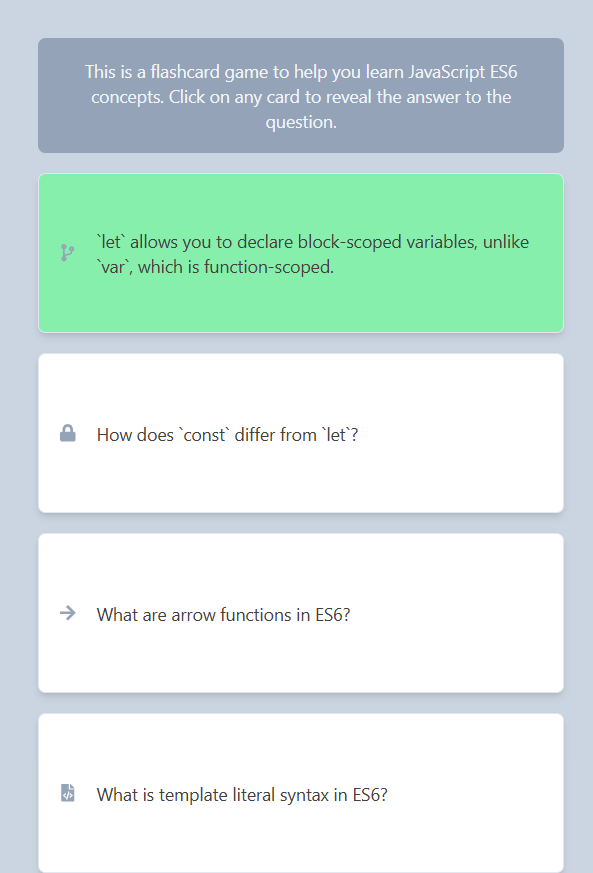
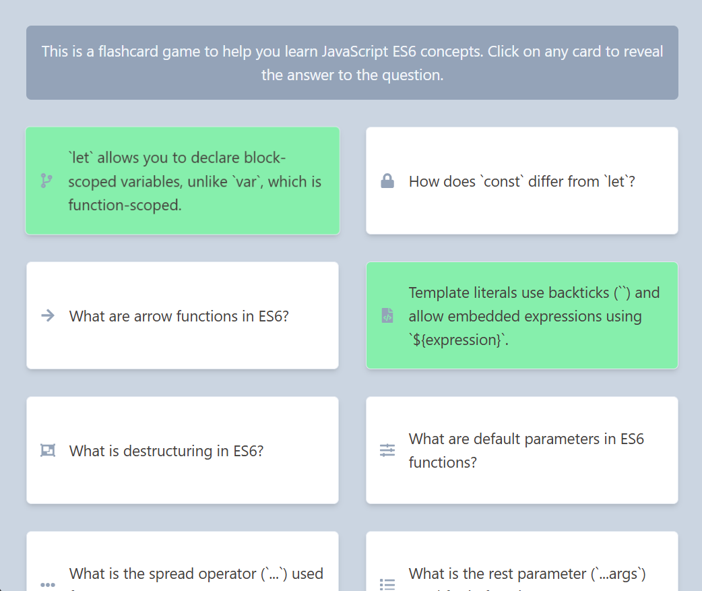

# 🧠 Flash card

An interactive and responsive Flash Card application built with React.js and styled using Tailwind CSS.
This project is designed to help you learn ECMAScript 6 (ES6) by answering a curated set of questions using a flip card (reveal) interface.

---

## ✨ Features

- 🧩 Flashcard-based learning: Tackle ECMAScript 6 concepts one card at a time.
- 🖌️ Styled with Tailwind CSS: Modern, responsive UI out of the box.
- 🔄 Reveal answer on click: Flip cards to check your understanding in real time.
- 📝 Customizable questions: Easily modify or expand the question set in a single data file.

---

## 📂 Flash card Structure

The flashcards are managed through a simple JavaScript data file that contains an array of objects.
Each object represents a single flashcard with a question and its corresponding answer.

### Example of the flashcard data structure:

```javascript
// data.jsx
import {
  FaCodeBranch,
  FaLock,
  FaArrowRight,
  FaFileCode,
  FaObjectGroup,
  FaSlidersH,
  FaEllipsisH,
  FaList,
  FaHourglassHalf,
  FaSyncAlt,
} from "react-icons/fa";

export const questions = [
  {
    id: 1,
    question: "What is the purpose of `let` in ES6?",
    answer:
      "`let` allows you to declare block-scoped variables, unlike `var`, which is function-scoped.",
    icon: <FaCodeBranch />,
  },
  {
    id: 2,
    question: "How does `const` differ from `let`?",
    answer:
      "`const` declares block-scoped constants, meaning the variable can't be reassigned after it's set.",
    icon: <FaLock />,
  },
  {
    id: 3,
    question: "What are arrow functions in ES6?",
    answer:
      "Arrow functions provide a shorter syntax for writing functions and do not bind their own `this`.",
    icon: <FaArrowRight />,
  },
  {
    id: 4,
    question: "What is template literal syntax in ES6?",
    answer:
      "Template literals use backticks (``) and allow embedded expressions using `${expression}`.",
    icon: <FaFileCode />,
  },
  {
    id: 5,
    question: "What is destructuring in ES6?",
    answer:
      "Destructuring allows unpacking values from arrays or properties from objects into distinct variables.",
    icon: <FaObjectGroup />,
  },
  {
    id: 6,
    question: "What are default parameters in ES6 functions?",
    answer:
      "Default parameters let you set default values for function arguments if none are provided.",
    icon: <FaSlidersH />,
  },
  {
    id: 7,
    question: "What is the spread operator (`...`) used for?",
    answer:
      "The spread operator expands arrays or objects into individual elements or properties.",
    icon: <FaEllipsisH />,
  },
  {
    id: 8,
    question: "What is the rest parameter (`...args`) used for in functions?",
    answer:
      "It allows a function to accept an indefinite number of arguments as an array.",
    icon: <FaList />,
  },
  {
    id: 9,
    question: "What is a Promise in ES6?",
    answer:
      "A Promise represents the eventual completion (or failure) of an asynchronous operation.",
    icon: <FaHourglassHalf />,
  },
  {
    id: 10,
    question: "What is the difference between `map()` and `forEach()`?",
    answer:
      "`map()` returns a new array with the results, while `forEach()` simply executes a function for each item without returning a new array.",
    icon: <FaSyncAlt />,
  },
];
```

## 📸 Demo

> **Published on Vercel**  
> [Flash card](https://flash-card-henna-ten.vercel.app/)

---

## 📸 Screenshots / Demo

Here are some screenshots showcasing the features of the project:





## 🛠️ Installation and Usage

Follow these steps to run the project locally:

### 1. Clone the repository

```bash
git clone https://github.com/Tamer-E-Amer/flash-card.git

```

### 2. Navigate into the project directory

```bash
cd flash-card
```

### 3. Install dependencies

```bash
npm install
```

### 4. Start the development server

```bash
npm run dev
```

## 📋 Technologies Used

- ⚛️ **React.js** — Frontend library for building the UI
- 🎨 **Tailwind CSS** — Utility-first CSS framework for styling
- ⚡ **Vite.js** — Lightning fast development build tool

## 🤝 Contributing

Contributions are welcome!  
If you have ideas for improvements or new features, feel free to open an issue or submit a pull request.

## 📄 License

This project is licensed under the [MIT License].

## 📬 Contact

Created with ❤️ by [Tamer Amer]
